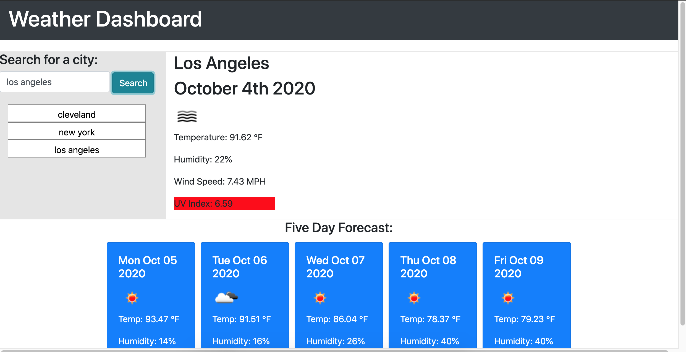

This application uses HTML, CSS, Javascript/JQuery and OpenWeatherMAP APIS
to create a dynamic and interactive weather dashboard for users. The user
inputs a city and upon clicking search will return the current weather conditions (including a color-coded UV index value and dynamic icons) for the present day as well as a five day forecast. The user's recent searches will be saved as buttons underneath the search bar to allow for easy access. These values are saved in local storage, and the most recent city search will populate on the web page when the user opens the page (provided local storage is not cleared). 

Link to Github repo: https://github.com/jordanmorse/weatherdashboard
Link to deployed site: https://jordanmorse.github.io/weatherdashboard/

